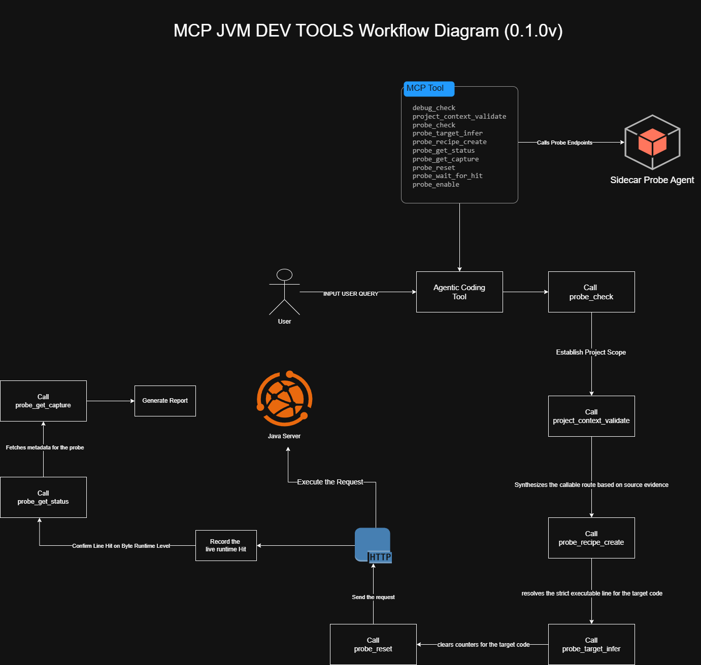

# How It Works



This document walks you through how `mcp-java-dev-tools` operates in practice — what it needs to run, how the orchestration flow works, and what each use case looks like end-to-end.

---

## Before You Start

Make sure these preconditions are met before running any workflow:

- The Java agent is attached to your target service and probe endpoints are reachable
- `MCP_PROBE_BASE_URL` points to the sidecar/probe endpoint
- If your endpoint requires credentials, include them in your prompt — they can't be inferred
- Strict line probe runs use `Class#method:line` semantics
- Runtime route synthesis only scans runtime sources (`src/main/java` + generated-main roots) — not `src/test/java`
- Orchestration decisions must use deterministic fields (`resultType`, `status`, `reasonCode`, `failedStep`) rather than confidence scores or heuristics

**Required recipe inputs:**
- `projectRootAbs`
- Exact FQCN in `classHint`
- Exact `methodHint`
- `lineHint` when `intentMode=line_probe` (strict probe verification mode)
- Auth when the endpoint requires it

**Helpful to provide explicitly:**
- API base URL / context path
- Probe base URL
- Application port

**Context path prompting policy:** Ask for the context path (e.g. `apiBasePath` like `/api/v1`) at most once per run, then reuse that value across all endpoint recipes in that run. A missing context path is a soft prompt — it won't block synthesis.

**Verifying agent instrumentation:** On startup, the agent logs each instrumented class:

```txt
[mcp-probe]: com.yourpackagename.yourclassname
```

If you don't see your classes listed, the agent isn't covering them yet.

---

## Use Case 1: Single Line Probe with Bearer Auth

Use this when you want a reproducible recipe for a specific class, method, and line — with runtime proof that the line was hit.

### Input Pattern

- **Repo:** `{repo-name}`
- **Target:** `{fullyQualifiedClassName}.{method}:{lineOfCode}`
- **Auth:** `Bearer <token>`

### Example Prompt

```txt
Create a reproducible single-line probe recipe for `{repo-name}`.
Target line: `com.acme.catalog.service.PriceService.finalPriceLte:128`.
Use bearer auth: `Bearer eyJhbGciOi...`.
Return the exact request plan and probe verification steps.
```

### What Happens

1. The orchestrator resolves the project root and passes `projectRootAbs`
2. `project_context_validate` optionally validates the scoped project context for that root
3. `probe_recipe_create` is called with `projectRootAbs`, `intentMode=line_probe`, exact FQCN in `classHint`, method/line hints, optional `apiBasePath`, and auth context
4. The tool performs code-based route inference through synthesizer plugins backed by the generic JVM AST request-mapping resolver, returning `executionReadiness`, `requestCandidates`, `inferredTarget`, and `selectedMode`
5. Framework adapters resolve annotation semantics (for example Spring `@RequestParam`, `@PathVariable`, `@RequestBody`) into normalized parameter metadata before HTTP materialization
6. Generic HTTP transport materializes path/query/body templates from normalized parameters and applies optional project fixture profile overrides from `.mcp-java-dev-tools/request-template.properties`
7. If `resultType=report`, treat it as fail-closed - read the compact execution metadata (`executionPlan.routingReason`, `executionPlan.steps[].actionCode`) and synthesis diagnostics
8. On a ready state, `probe_reset` clears the baseline counter for the strict line key
9. The orchestrator fires the selected HTTP trigger using the bearer token
10. `probe_wait_for_hit` confirms the line was executed; if unavailable, `probe_get_status` provides a detailed status payload
11. When `capturePreview.captureId` is present, `probe_get_capture` retrieves the full runtime capture for arguments and context evidence

### What You Get Back

| Artifact | Contents |
|---|---|
| **Recipe** | Selected mode, HTTP request (method/path/headers/body template), strict probe key (`Class#method:line`) |
| **Probe verification** | Hit/no-hit result, inline status, last status snapshot |
| **Runtime evidence** | `captureId` and full capture payload (when available) |
| **Pushback** | `reasonCode`, `attemptedCandidates`, `validationResults`, `nextAction`, ordered repro steps (fail-closed cases) |

---

## Use Case 2: Controller Regression Run with Bearer Auth

Use this when you want to run HTTP regression tests across all routes in a controller and verify which ones can be probe-confirmed.

### Input Pattern

- **Repo/API scope:** `{repo-name}-api`
- **Controller:** `{fullyQualifiedClassNameOfController}`
- **Auth:** `Bearer <token>`

### Example Prompt

```txt
Run controller regression for `catalog-api`.
Controller: `com.acme.catalog.api.ProductController`.
Use bearer auth `Bearer eyJhbGciOi...`.
Return endpoint-level HTTP results and any probe-verifiable evidence.
```

### What Happens

1. The orchestrator resolves the API project and passes `projectRootAbs`
2. `project_context_validate` optionally validates the scoped project context
3. For each route under the controller, `probe_recipe_create` is called with the exact FQCN (and shared `apiBasePath` when applicable) to produce executable request candidates and auth/readiness diagnostics
4. If `probe_recipe_create` returns `resultType=report`, that route is treated as fail-closed — use the compact execution metadata and diagnostics for routing decisions
5. The orchestrator fires regression HTTP requests route-by-route with bearer auth and records outcomes
6. Probe verification is only applied when strict line targets are available for an endpoint
7. For probe-eligible endpoints: `probe_reset` → execute HTTP request → `probe_wait_for_hit` (or `probe_get_status`) confirms runtime line execution
8. Any capture preview discovered during status checks can be expanded via `probe_get_capture`
9. Endpoints without strict line mapping remain HTTP-only and must be explicitly marked as non-probe-verified

### What You Get Back

| Artifact | Contents |
|---|---|
| **Regression results** | Endpoint matrix: method, path, expected/actual HTTP status, pass/fail |
| **Coverage summary** | Probe-verified endpoints vs. HTTP-only endpoints |
| **Evidence** | Per-endpoint probe status and optional capture payload reference |
| **Failure diagnostics** | Failed endpoint details with deterministic repro steps |

---

## Use Case 3: Regression Run + Repro Recipes for Failures

Use this when you want Use Case 2's regression run *plus* a focused, reproducible recipe for every endpoint that failed or was flagged.

### Input Pattern

Same as Use Case 2, with the added requirement to generate per-failure reproducible recipes.

### Example Prompt

```txt
Run controller regression for `catalog-api` on
`com.acme.catalog.api.ProductController` with bearer auth `Bearer eyJhbGciOi...`.
For every failed or flagged run, generate a reproducible recipe and include runtime/probe evidence when available.
```

### What Happens

1. Run the full Use Case 2 regression flow and collect all endpoint outcomes
2. Filter endpoints into `failed` or `flagged` sets (non-2xx, contract mismatch, probe-miss, etc.)
3. For each failed/flagged endpoint, call `probe_recipe_create` to produce a focused rerun recipe tied to the observed failure context
4. If strict line verification is possible, run `probe_reset` → targeted HTTP rerun → `probe_wait_for_hit` / `probe_get_status`
5. If a capture preview exists, call `probe_get_capture` and attach the evidence to that endpoint's recipe package
6. If the runtime route can't be uniquely validated during rerun, emit a fail-closed pushback artifact — not speculative guidance

### What You Get Back

| Artifact | Contents |
|---|---|
| **Regression report** | Full controller endpoint pass/fail summary |
| **Per-failure recipe bundle** | Endpoint-specific trigger request, auth requirements, strict probe target (when available), rerun steps |
| **Evidence bundle** | Probe hit/miss status, last status payload, optional capture payload — per failed/flagged endpoint |
| **Pushback bundle** | `probe_route_not_found` or `probe_route_ambiguous` with candidate validation details (when unresolved) |

---

## A Few Important Reminders

- **Don't claim probe success without verification.** A probe hit must be confirmed via strict `Class#method:line` check or by observing a breakpoint pause in your IDE.
- **Include everything the agent can't infer.** Auth tokens in particular must be in your prompt — the tool has guardrails, but it can't guess credentials.
- **Data synthesis is the tool's job.** You provide the inputs and context; the coding agent handles synthesis.
